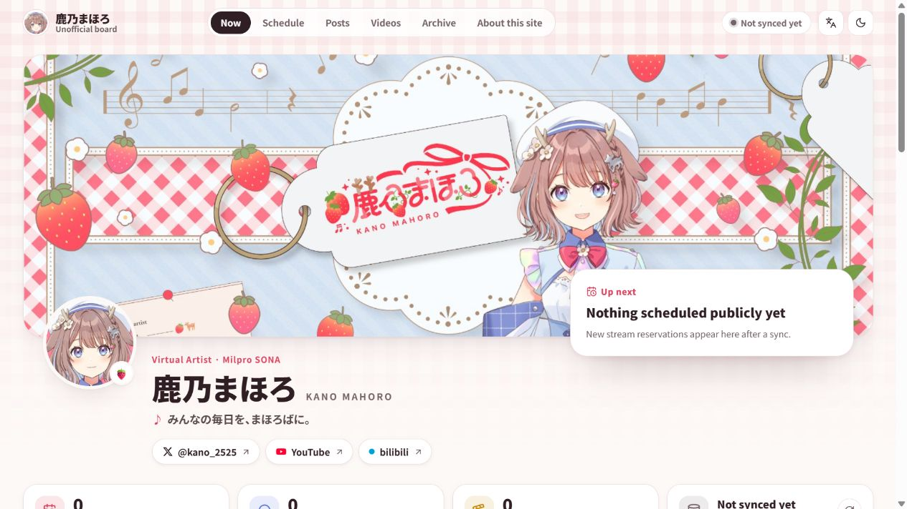
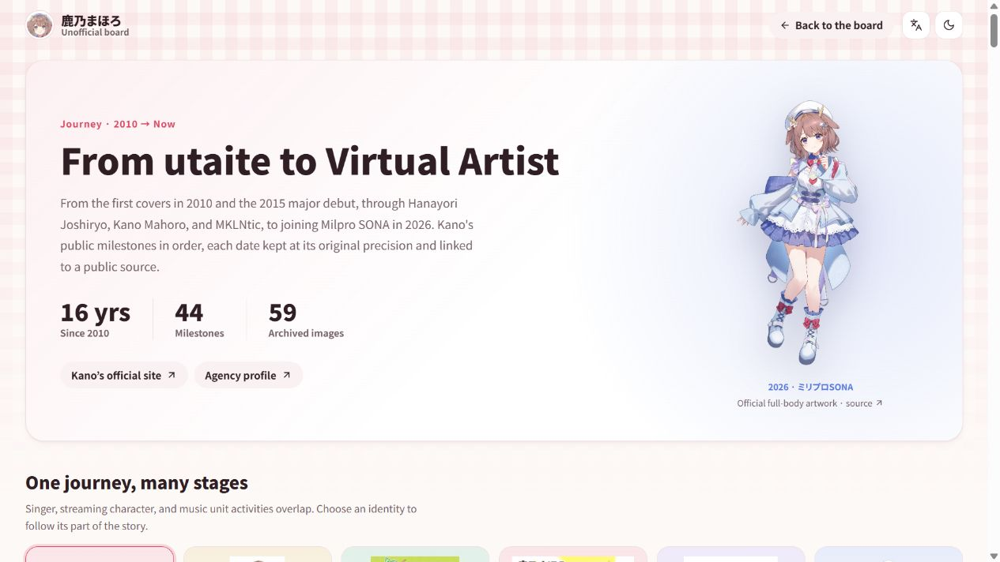

<div align="center">
  
  <h1>Kano Navi</h1>
  <p><strong>Kano Mahoro's updates, schedules, and journey — in one place.</strong></p>
  <p>
    <a href="https://github.com/yexca/kano-navi/actions/workflows/ci.yml"></a>
    <a href="https://github.com/yexca/kano-navi/actions/workflows/release.yml"></a>
    <a href="LICENSE"></a>
  </p>
  <p>
    <a href="https://kano.yexca.net/"><strong>Live site</strong></a> ·
    <a href="#features">Features</a> ·
    <a href="#quick-start-with-docker">Quick start</a> ·
    <a href="docs/README.md">Documentation</a> ·
    <a href="https://github.com/yexca/kano-navi/releases">Releases</a>
  </p>
  <p>English · <a href="README.zh-cn.md">简体中文</a></p>
</div>

Kano Navi is an unofficial, self-hosted fan board for **Kano Mahoro (鹿乃まほろ)**.
Catch the next stream, follow recent X and YouTube activity, and explore her
public history from 2010 onward. The interface supports Japanese, English, and
Simplified Chinese, with light and dark themes and layouts for desktop and mobile.

## Preview

Visit **[Kano Navi](https://kano.yexca.net/)** or explore the
[journey and visual archive](https://kano.yexca.net/history).
The screenshots show a fresh local instance; source feeds populate after a workflow runs.



<details>
<summary>Journey page preview</summary>



</details>

## Features

| Area                     | What you can do                                                                                                       |
| ------------------------ | --------------------------------------------------------------------------------------------------------------------- |
| Status board             | See the next stream or event, a Japan-time countdown, and recent activity at a glance.                                |
| Weekly schedule          | Browse the week's agenda and schedule image, with labels for automatic extraction and manual confirmation.            |
| X & YouTube              | Read posts from both X accounts, browse uploads and scheduled streams, and highlight a Featured video.                |
| Journey & visual archive | Explore milestones by identity and year, and browse bundled images with source links and credits.                     |
| Operator console         | Run or schedule update workflows, curate events, manage profile media, and configure optional AI schedule extraction. |
| MCP integration          | Read public snapshots and use separately authenticated controls to start automatic jobs.                              |

## Quick start with Docker

Requires **Docker with Linux containers and Docker Compose**.

1. Save [docker-compose.yml](docker-compose.yml) and [.env.example](.env.example)
   in the same directory. Copy `.env.example` to `.env`.
2. Edit `.env`: keep `APP_MODE=production` and set `ADMIN_PASSWORD` to a password
   with at least **12 characters after trimming surrounding whitespace**.
3. Start the application:

   ```bash
   docker compose up -d
   ```

Open **[Kano Navi at localhost:7657](http://localhost:7657/)**.
The operator console is at `/admin`; enter that path directly and sign in with
the password you configured.

Compose pulls `yexca/kano-navi:latest`. The `./data` directory keeps your database,
cached media, and operator settings across upgrades. Run `docker compose up -d`
again to pull an update and replace the container.

For a pinned release, GHCR images, custom ports, or a reverse proxy, see
[Docker deployment](docs/operations/docker.md).

### First launch

The profile, milestones, resource links, and history images are available immediately.
X posts, YouTube videos, schedules, and AI providers start empty.

- Open `/admin` and run a workflow with X, YouTube, and media cache steps to populate the board.
- Enable a timer on a saved workflow if you want regular updates.
- For optional AI schedule extraction, configure `LLM_SECRETS_KEY` in `.env`,
  then add providers, models, and detection routes in the console. See
  [configuration](docs/operations/configuration.md) for setup.

## How updates work

Workflows collect public content on the server, cache its media, and write a local
SQLite snapshot. Page loads and the board's reload button read that snapshot;
they do not start platform or model requests. If a source fails, the last known
snapshot remains available.

Manual schedule edits and deletions are protected from automatic overwrites or
resurrection. Source availability determines freshness, and the original
platform pages remain authoritative. See [sources](docs/architecture/sources.md)
and [workflows](docs/architecture/workflows.md) for coverage and fetch limits.

## Develop locally

Requires **Node.js 24.19+ in the 24 LTS line**, **npm 10+**, and Git.

```bash
git clone https://github.com/yexca/kano-navi.git
cd kano-navi
npm ci
cp .env.example .env
```

For local development, set `APP_MODE=development` in `.env` to enable password-free
admin access, and `WORKFLOW_SCHEDULER_ENABLED=0` to disable timed workflows. Then run:

```bash
npm run dev
```

The frontend and API share [localhost:7657](http://localhost:7657/).
In PowerShell, use `Copy-Item .env.example .env` for the copy step.
See [local development](docs/development/local-dev.md) for build, preview, and
Docker development instructions.

The project uses **React · TypeScript · Vite · Tailwind CSS · Express · SQLite**.
GNU Make is the validation entry point:

```bash
make check             # Installed-dependency checks, build, and isolated API smoke
make ci                # Locked installation plus all checks and Docker runtime validation
make sensitive-check   # Sensitive-information scan
```

These checks do not run live source synchronization. See
[testing and CI](docs/development/testing.md) for focused targets and prerequisites.

## Documentation

| Looking for…                                | Start here                                                               |
| ------------------------------------------- | ------------------------------------------------------------------------ |
| Project scope and page behavior             | [Overview](docs/overview.md)                                             |
| Deployment, configuration, and backups      | [Operations](docs/operations/index.md)                                   |
| API, data model, sources, and media         | [Architecture](docs/architecture/index.md)                               |
| History image sources and credits           | [History & visual archive](docs/product/history.md)                      |
| Development, checks, and contribution rules | [Development](docs/development/index.md) · [Agent guide](AGENTS.md)      |
| Security boundaries and reporting           | [Security policy](SECURITY.md) · [Security docs](docs/security/index.md) |

Browse the [documentation index](docs/README.md) for the full guide.

## Credits & license

Created by [yexca](https://github.com/yexca). The application's `/about` page lists
the development credits and technology stack.

Project code is licensed under [GNU AGPL v3](LICENSE). Artwork, artist names, and
other third-party content retain their original rights; the code license does
not grant rights to those materials. Image sources and recorded credits are
documented in the [history archive](docs/product/history.md).

Kano Navi is an independent fan project with no official affiliation or endorsement.
